# ekstask
# Problem Statement

## Have to launch the EKS cluster in AWS and launch the app EC2 instance of WordPress and its Database like MySQL. Using EFS as a storage.

## Solution for this problem is:
 

### Initial steps:

* Make a account in AWS and make a IAM user with the administration power.

* Download the awscli, eksctl and kubectl and set the environment variables.

* Login in CLI with that user you have created.

### Step 1: Creating the cluster in EKS with 3 nodes, create the cluster.yml file:

```
* cluster.yml

apiVersion: eksctl.io/v1alpha5
kind: ClusterConfig

metadata:
  name: saracluster
  region: ap-south-1

nodeGroups:
   - name: ng1
     desiredCapacity: 2
     instanceType: t2.micro
     ssh:
        publicKeyName: mykeylw
   - name: ng-mixed
     minSize: 1
     maxSize: 3
     instancesDistribution:
       maxPrice: 0.017
       instanceTypes: ["t2.micro"] # At least one instance type should be specified
       onDemandBaseCapacity: 0
       onDemandPercentageAboveBaseCapacity: 50
       spotInstancePools: 2     
     ssh:
         publicKeyName: mykeylw
```

```
eksctl create cluster -f cluster.yml
```

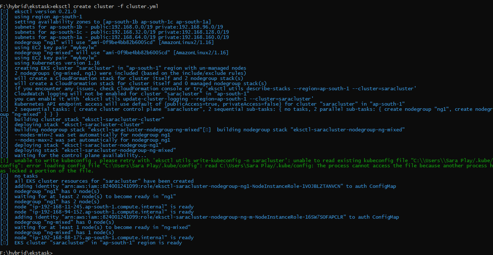

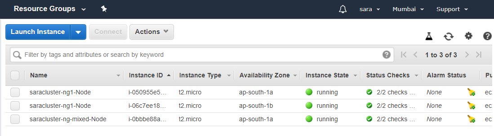

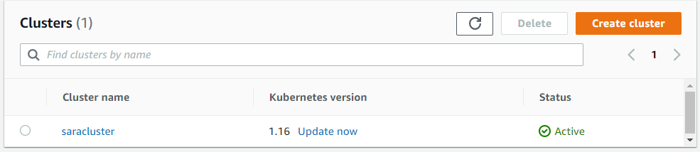

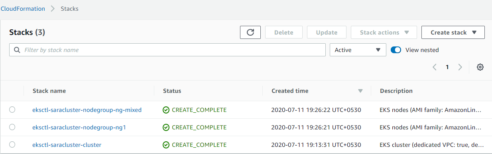

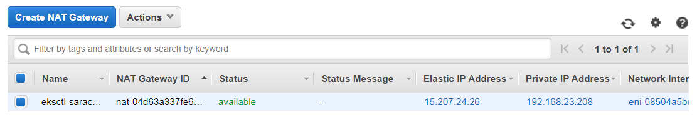

* Here there are 2 node groups and in 1st node group we have desired 2 nodes and in 2nd we have spot instances that is it launches when oad increase, we have given min and max size if instance so it launches the min number f nodes first.

* This file creates all the reqiurements like cluster, VPC, subnets, NAT gateway, Internet gateway, cloudformation, etc.

* It will take time like 15 to 20 minutes. 

### Step 2: Update the kubeconfig file as kubectl will use the default kubernetes so we have to update the config file of the kubectl.

```
aws eks update-kubeconfig --name saracluster
```

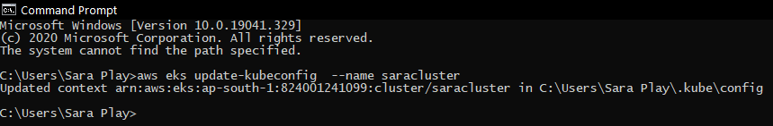

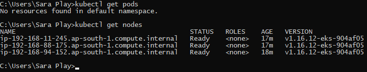

### Step 3: Create the new namespace as it is used to keep our work in different room and easy to maintain.

```
kubectl create ns sarans
```
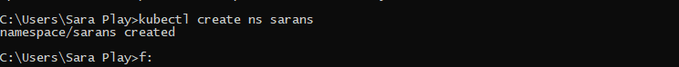

* Update the default namespace.

```
kubectl config set-context --current --namespace=sarans
```
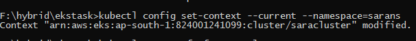

### Step 4: Now we have to create the EFS first as we are using EFS instead of EBS storage:

* This can be done manually by going to AWS or we can use the terraform to create the EFS, here creating manually.

* Important thing while creating, we have to create in the same VPC and in same subnets in which nodes are running so simply go and check the EC2 instances then select the desired one then create.

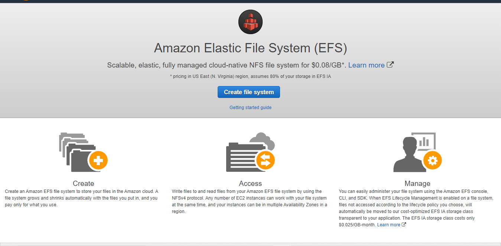

### Step 5: Now create the EFS provisioner as EFS use the provisioner:

```
* efs-pro.yml

kind: Deployment
apiVersion: apps/v1
metadata:
  name: efs-provisioner
spec:
  selector:
    matchLabels:
      app: efs-provisioner
  replicas: 1
  strategy:
    type: Recreate
  template:
    metadata:
      labels:
        app: efs-provisioner
    spec:
      containers:
        - name: efs-provisioner
          image: quay.io/external_storage/efs-provisioner:v0.1.0
          env:
            - name: FILE_SYSTEM_ID
              value: fs-0d63e9dc
            - name: AWS_REGION
              value: ap-south-1
            - name: PROVISIONER_NAME
              value: sara-pro/aws-efs
          volumeMounts:
            - name: pv-volume
              mountPath: /persistentvolumes
      volumes:
        - name: pv-volume
          nfs:
            server: fs-0d63e9dc.efs.ap-south-1.amazonaws.com
            path: /
```

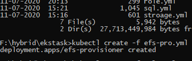

* Here we have used the id and DNS server name of the filesystem we have created.

### Step 6: Now create the nfs-provisioner-role-binding:

```
* role.yml

---
apiVersion: rbac.authorization.k8s.io/v1beta1
kind: ClusterRoleBinding
metadata:
  name: nfs-provisioner-role-binding
subjects:
  - kind: ServiceAccount
    name: default
    namespace: sarans
roleRef:
  kind: ClusterRole
  name: cluster-admin
  apiGroup: rbac.authorization.k8s.io

```

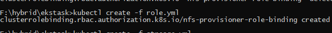

### Step 7: In this step we have created the storage class and 2 pvc one for WordPress and One for MySQL.

```
* storage.yml 

kind: StorageClass
apiVersion: storage.k8s.io/v1
metadata:
  name: aws-efs
provisioner: sara-pro/aws-efs
---
kind: PersistentVolumeClaim
apiVersion: v1
metadata:
  name: efs-drupal
  annotations:
    volume.beta.kubernetes.io/storage-class: "aws-efs"
spec:
  accessModes:
    - ReadWriteMany
  resources:
    requests:
      storage: 5Gi
---
kind: PersistentVolumeClaim
apiVersion: v1
metadata:
  name: efs-mysql
  annotations:
    volume.beta.kubernetes.io/storage-class: "aws-efs"
spec:
  accessModes:
    - ReadWriteMany
  resources:
    requests:
      storage: 5Gi

```

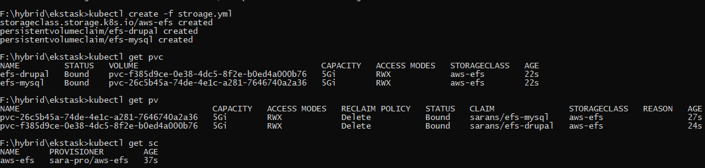

### Step 8: Now run our final app files first we have to create the secret file as we have used in our database:

```
create secret generic mysql-pass --from-literal=password=saraplay
```

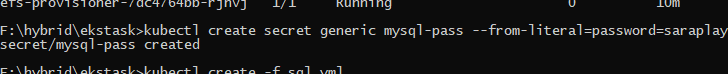

* Now run the sql.yml file to create the sql pods and it will create in one of the nodes or cluster of kubernetes:

```
apiVersion: v1
kind: Service
metadata:
  name: drupal-mysql
  labels:
    app: drupal
spec:
  ports:
    - port: 3306
  selector:
    app: drupal
    tier: mysql
  clusterIP: None
---
apiVersion: apps/v1 # for versions before 1.9.0 use apps/v1beta2
kind: Deployment
metadata:
  name: drupal-mysql
  labels:
    app: drupal
spec:
  selector:
    matchLabels:
      app: drupal
      tier: mysql
  strategy:
    type: Recreate
  template:
    metadata:
      labels:
        app: drupal
        tier: mysql
    spec:
      containers:
      - image: mysql:5.6
        name: mysql
        env:
        - name: MYSQL_ROOT_PASSWORD
          valueFrom:
            secretKeyRef:
              name: mysql-pass
              key: password
        ports:
        - containerPort: 3306
          name: mysql
        volumeMounts:
        - name: mysql-storage
          mountPath: /var/lib/mysql
      volumes:
      - name: mysql-storage
        persistentVolumeClaim:
          claimName: efs-mysql

```

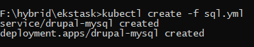

* Next create the wordpress here i am using the joomla instead of wordpress:

```

apiVersion: v1
kind: Service
metadata:
  name: drupal
  labels:
    app: drupal
spec:
  ports:
    - port: 80
  selector:
    app: drupal
    tier: frontend
  type: LoadBalancer
---
apiVersion: apps/v1 # for versions before 1.9.0 use apps/v1beta2
kind: Deployment
metadata:
  name: drupal
  labels:
    app: drupal
spec:
  selector:
    matchLabels:
      app: drupal
      tier: frontend
  strategy:
    type: Recreate
  template:
    metadata:
      labels:
        app: drupal
        tier: frontend
    spec:
      containers:
      - image: joomla
        name: drupal
        env:
        - name: JOOMLA_DB_HOST
          value: drupal-mysql
        - name: JOOMLA_DB_PASSWORD
          valueFrom:
            secretKeyRef:
              name: mysql-pass
              key: password
        ports:
        - containerPort: 80
          name: drupal
        volumeMounts:
        - name: drupal-storage
          mountPath: /var/www/html
      volumes:
      - name: drupal-storage
        persistentVolumeClaim:
          claimName: efs-drupal

```

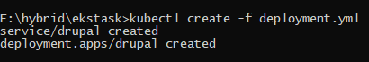

* After that see the pods.

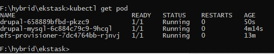

* Now run the kubectl get all command to get all the services from here we can also get the ip of the joomla and you can see that mysql doees'nt have any IP as it is launched in cluster IP.

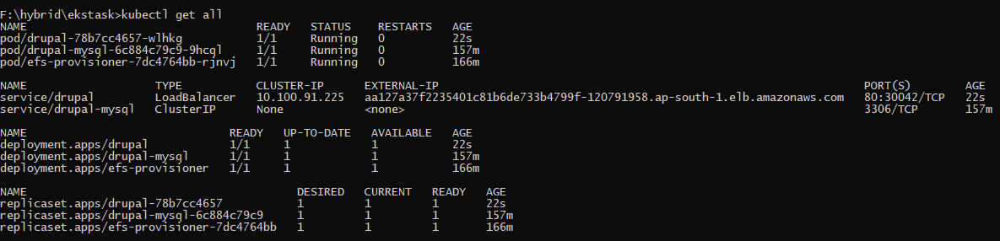

* Output: Copy the link and open in any browser:

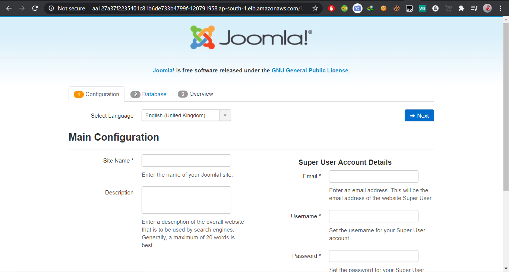

* Last if you want to delete the whole cluster then run this command:

```
eksctl delete --region-ap-south-1 --name=saracluster
```

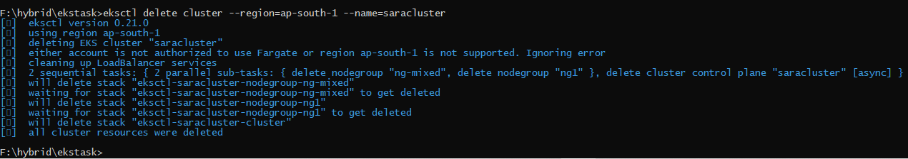

* But EFS will deleted you have to it manually.

* Check the bill after this as EKS will charge and NAT gateway and EFS also.

## Author

[SAURAV PATEL](https://www.linkedin.com/in/saurav-patel-148539151/)

## Thank You !!!
